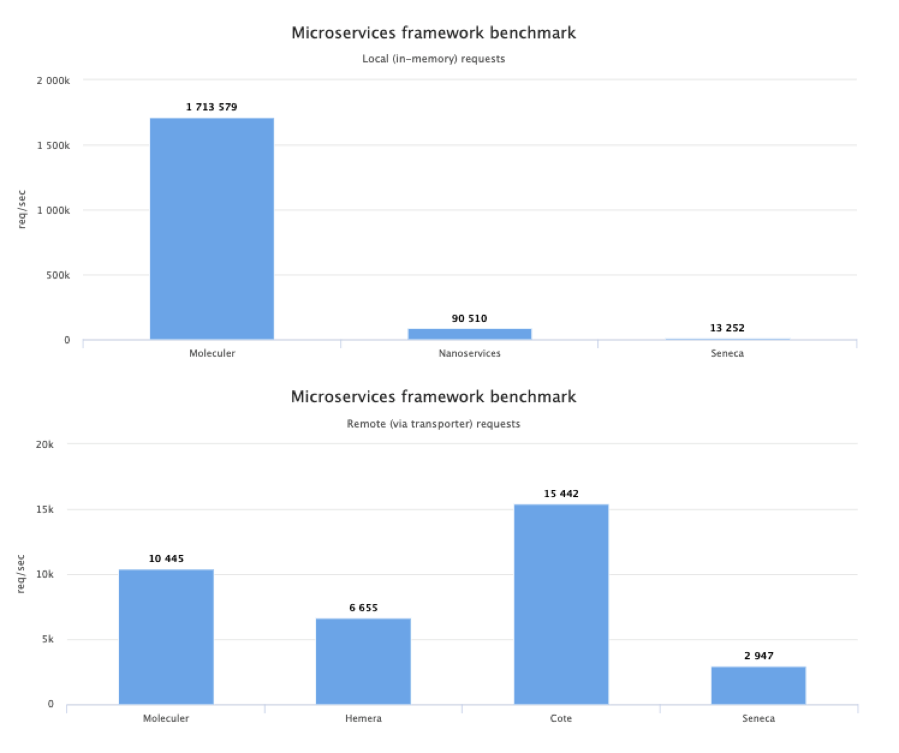

# 什么是 Moleculer?

Molecular 是一个快速、现代和强大的 node.js 微服务框架。它可以帮助我们建立一个高效的、可靠的和可扩展的服务。Molecular 在构建和管理微服务上有很多自己的特征，下面详细介绍其特征。

## 特征

- 基于 Promise 的解决方案（兼容 async/await）
- 支持 request-reply 的概念
- 支持 stream
- 支持事件驱动的负载均衡体系
- 内置 service 注册和动态 service 发现策略
- 对请求和事件（循环、随机、CPU使用、延迟）有负载平衡策略
- 有许多容错策略（断路器、隔板、重试、超时、回退）
- 支持中间件
- 支持版本化 service
- 支持 service mixins
- 内置缓存解决方案（内存、redis）
- 支持可插拔的数据通信（TCP、NATS、MQTT、Redis、NATS流、Kafka）
- 支持可插拔序列化程序（JSON、AVRO、MSGPack、协议缓冲区、Thrift）
- 支持可插拔验证器
- 支持节点/服务器上的多个 service
- 所有节点都相等，没有主节点
- 使用[fastest-validator](https://github.com/icebob/fastest-validator)进行参数验证
- 内置健康监测和指标
- 官方[ API gateway module](https://github.com/moleculerjs/moleculer-web)和许多其他模块...

## Molecular 有多快？

为了创建一个基于 node.js 的最快的微服务框架，我们花了很多时间来提升 Molecular 的性能，下面两个数据对比的图表也可以直观的反映出 Moleculer 的优势。

你也可以克隆[代码库](https://github.com/icebob/microservices-benchmark)到你本地，然后执行 `npm install && npm start`，在你本地检测服务的速度。

[查看基准测试结果](https://moleculer.services/docs/0.13/benchmark.html)。

## 版本控制

在 Moleculer 发布 1.0 版本以前，大变更主要通过次要版本控制。比如： 0.13.1 或 0.13.4 末位版本迭代会做到向下兼容，但是 0.14.0 则表示是大版本迭代，不会向下兼容